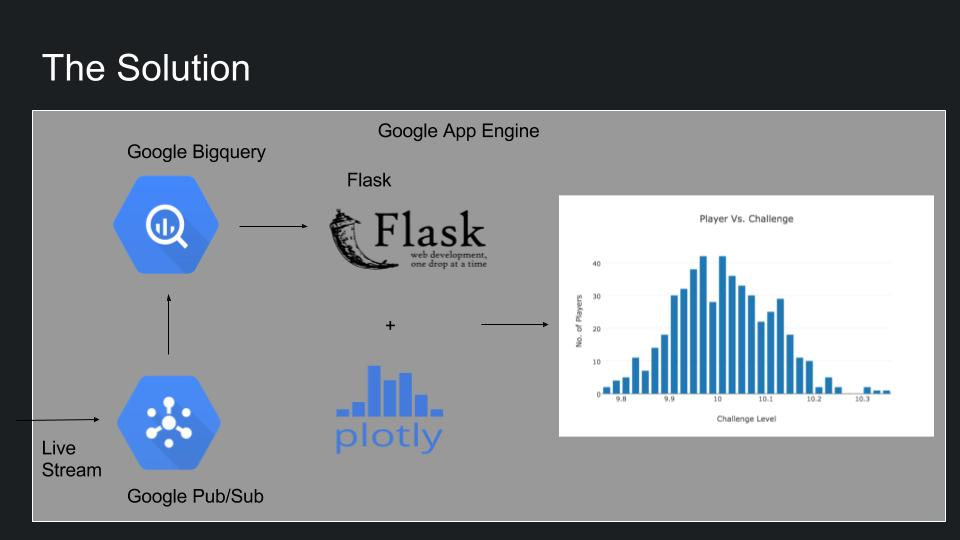

# Player 2

A consulting project through Insight

This is a consulting project I did while I was a Data Engineering Fellow at Insight Data Science. The company I consulted for wishes to stay anonymous and honoring their request the description of the company, product and the solution are explained in an abstract fashion.
Company name is "Player 2" from here on.
 
## Table of Contents
1. [The Product](README.md#the-product)
2. [The Data](README.md#the-data)
3. [The Deliverables](README.md#the_deliverables)
4. [The Solution](README.md#the-solution)
5. [The Workflow](README.md#the-workflow)
6. [The Pipeline](README.md#the-pipeline)
7. [Resources](README.md#resources)

## The Product 
Player 2 is a rapidly growing company working in the gaming industry. With the rapid growth and steady increase in the users each day, incoming data is increasing as well. Thus the complany required data architecture and pipeline implementation which could scale well and serve the players on the platform.

The main focus was to increase customer engagement and prevent customers from leaving. A close example and the name of the project comes from gaming industry. Imagine playing a new game and quickly losing interest in it due to the game being too difficult or very easy for your skill level. 
The goal is to classify struggling players and cater an experience tailored to their skillset to prevent churning. To achieve this, several predictive analytics techniques are employed to detect such players.

## The Data
The data about the players and their interactions with the game is in two formats.

### Streaming Data 
As soon as the player opens the game and start playing each interaction is logged and send to the server. These logs contains different data such as how many times was a particular challenge played, did the player successfully complete the challenge and what time was the challenge tried to name just a few. 

e.g., `Query String from User's device`:

    challenge_lvl=5&player_id=12345&interaction_time="2017-05-02 02:25:01"....

### Historical Data
Since the foundation of the company each past transaction log has been saved in a columnar database. For the deliverables in this project all this data will be leveraged as well.

e.g., `Database`:
    
    challenge_lvl=5&player_id=12345&interaction_time="2017-05-02 02:25:01"....
    challenge_lvl=3&player_id=12343&interaction_time="2017-05-02 02:18:01"....
    challenge_lvl=9&player_id=12348&interaction_time="2017-05-01 02:25:01"....

## The Deliverables
The deliverables for the project are the three pillars for any data driven startup in the Valley.

####Pipeline
Build the data pipeline architecture for the company which can scale and work effectively with the high data throughput Player 2 plans in the future.
####Predictive Analysis
Build a predicitve analytics model which can calculate the players progress across the platform and classify players about to churn.
####Real-time Dashboard
Provide a visual analytics tool that the company can internally use to jump start there analytics and insight on their players interaction with the product. 

## The Solution
The solution uses Google Cloud Platform (GCP) for distributing the workload and the computation to multi node clusters. 
###The technologies used are:
* Google PubSub
* Google App Engine
* Google Big Query
* Google Storage
* Flask
* Plotly
* Pandas
* NumPy

In order to keep the companies data private I stood up my own pipelines from scratch to test out the various features required and to build the sample demo site linked in this repo.

## The Workflow

####Google Pubsub

As mentioned earlier as soon as the player starts playing the game the interactions are logged and send to Google Pubsub topic. These messages are pushed to a specific app (not in code) on Google App Engine which processes the messages and saves the results to Google Big Query in two different tables. 
####Google Bigquery
The first table is the raw dump of the entire incoming message where it is stored in different columns as per the requirements. 

The second table is specifically designed for the analytics dashboard and only stores the data relevant for the dashboard and of significance to the predictive analytics model. The reason for thsi data architecture is that the incoming data is very wide and contains a lot of data not required for dashboard. Storing data in such a fashion leads to less disk seeks and thus faster queries. 

####Dashboard

The dashboard as displayed in the demo is deployed as another module of the app in the App Engine and periodically creates business insights and visualizes important metrics on the dashboard. 

* The first plot shows the data about the number of players currently on each challenge. 

* The second plot shows the current failure rate for each individual challenge in the game. Both these graphs show the data for the past 7 days. 

* The third plot shows the predicitive analysis result and shows the progress of players in the game ( Note - The internal plot shows more details and can view progress per player_id). 

* Being an internal tool, more flexibility and control has been provided for the user in the fourth plot where they can query more complex answers and plot it by specifying the X and Y axis (Type "Null" to run a predefined query).

## The Pipeline

This is the visual representation of the pipeline as explained in the previous section. Please note that Google BigQuery is shown as a single component here whereas it contains the data in different tables (explained above)

Note - The pipeline code is not in this repo on companies request. I've added wrapper code that should be easy to modify for any pubsub topic and bigquery table

# Resources
* Demo - bit.ly/player2analytics
* Video demo - bit.ly/player2vid
* Demo Slides - bit.ly/player2slides
* This repo - bit.ly/player2git
* HTML Template - https://html5up.net/dimension

Note - The demo runs on the Google App Engine and uses all the GCP tools mentioned in the README earlier. 

## Directory Structure
The main.py runs the app and call the modules in the scripts folder to compute the different parts of the project. The HTML code and related css, images are in templates and static library.
